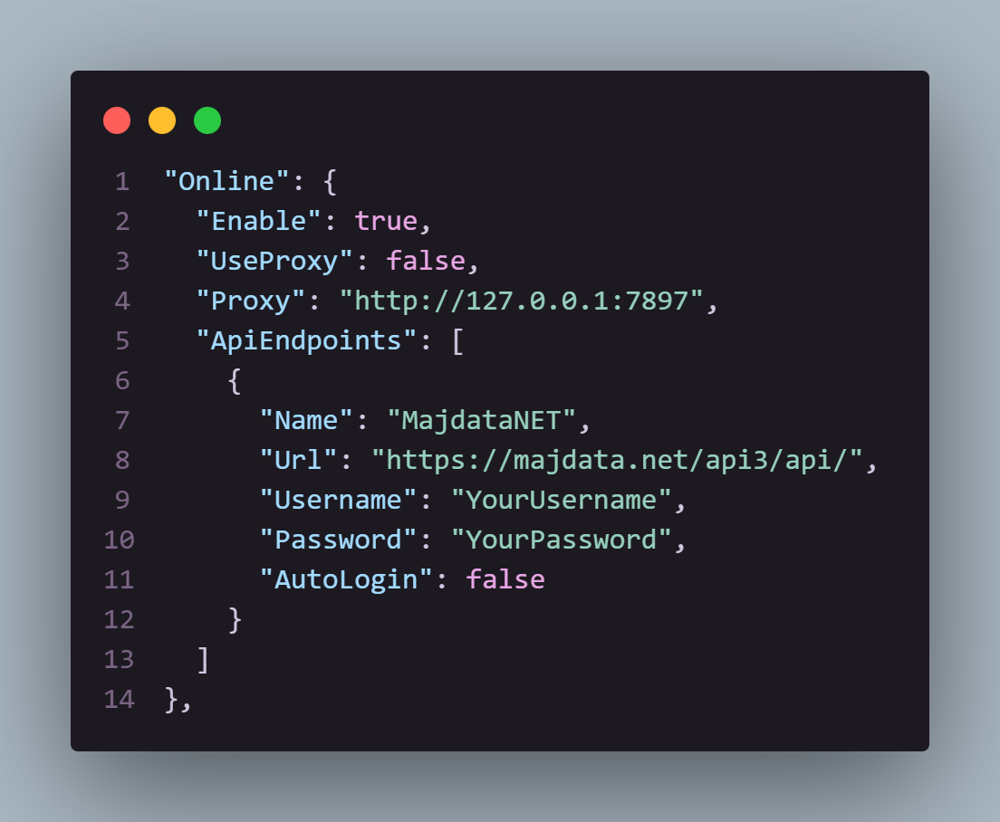

# Online

::: tip
想传分打榜/记录? 想直接在游戏内游玩在线谱面? 看我吧!
:::

## Windows

运行一次游戏后, 游戏的可执行文件的同级目录下会出现一个`settings.json`, 打开它 (推荐使用[VSCode](https://code.visualstudio.com/), 改错了会有划线提示)

往下滑, 或者按`Ctrl + F`搜索`Online`, 来到如图的地方. (可能和我有不一样的地方, 但不用管)

- 你需要把`"Enable": false,`改为`"Enable": true,`
- 如果人在大陆, 并且不会使用代理, 你也许需要更改`"Url"` 为以下镜像站中之一:
  - `"https://maj.moyingmoe.top/api3/api/"`
  - `"https://maj-2.moyingmoe.top/api3/api/"`
  - `"https://maj-3.moyingmoe.top/api3/api/"`

  (受各种因素影响, 某个镜像站可能无法使用, 此时你需要再更换一个)

到此为止, 你已经完成了联网项的基础配置

- 如果你想使用代理, 并且你**很清楚这一项是怎么填写的**, 请把`"UseProxy": false,`改为`"UseProxy": true,`, 并在`"Proxy"`后用字符串写上你的代理链接
- 如果你想使用预填写账密或自动登录, 你需要:
  - 在`"Username"`后填上自己的用户名
  - 在`"Password"`后填上自己的密码
  - 如果想要自动登录, 请把`"AutoLogin"`改为`true`
