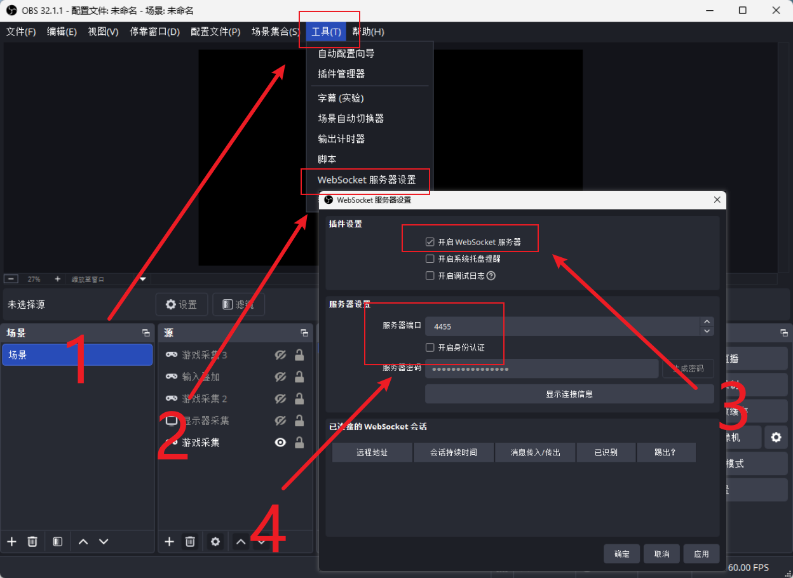

# Record

::: warning
本功能在移动端不可用
:::

## OBS 配置

本功能的原理是请小小蓝白帮你按录制键, 所以请先在 OBS 内配置好场景, 将 MajdataPlay 使用<mark>屏幕录制或游戏录制</mark>捕获, 如使用其他捕获模式可能无法录制

1. 点击顶部的`工具`
2. 点击下拉菜单中的`WebSocket 服务器设置`
3. 勾选`开启 WebSocket 服务器`
4. 将`服务器端口`设置为`4455`并<mark>取消</mark>勾选`开启身份认证`

## 游戏内设置

应该只需要把录制选项调为`OBS`

## 生效表现

如配置成功, 进入游玩后, 副屏的小小蓝白下方会有摄像头图标, ~~小小蓝白正在盗摄~~

//TODO 补充图片
