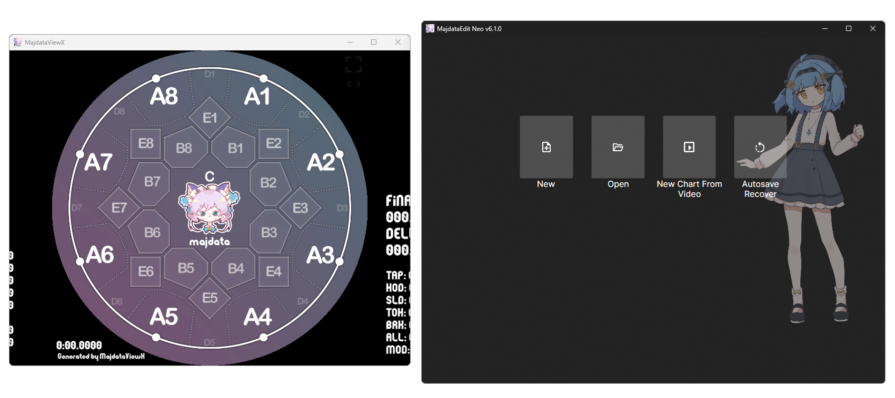

# 简介

## 总览

这不一定是你第一次打开软件时看到的样子，它们可能散落开来，所以你需要做第一次调整，它们的位置和大小将被记录下来，下次打开稳定在那里，~~不躲，不藏，不动，稳稳地接住你~~。

在你开始使用MajdataX之后，强大的性能会为你提供更好的体验。

::: tip
使用前，请先打开终端，输入`winget install ffmpeg`安装ffmpeg工具以正常使用跟音视频处理相关的功能。
:::

## 开源

