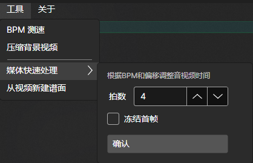

# 写谱前处理

::: warning
注意，在使用本页工具前，请先打开终端，输入`winget install ffmpeg`安装ffmpeg工具。
:::

## 调整时长

### 开头空一个小节

一般谱面会更建议不调offset而是调整音乐到`第一拍`正好在`音频起始一个小节处`，因此我们可以使用`工具->媒体快速处理`来实现。

在此之前，你需要先写一段`(bpm){1},`来让本工具获取到开头bpm，然后在下方波形图中将**第一条**黄线对准音频的第一拍，之后在下图面板处输入你想要的拍数，是否在时长不足时冻结首帧（不然则使用黑帧填充），最后点击`确认`。

请耐心等待，这个过程需要一定时间。

::: tip
完成这个流程，我建议这样做：
1. 不知道bpm时，借助图中`BPM测速`工具，手点拍子得到大致bpm
2. 知道bpm后，写一段类似`(bpm){4}1,1,1,1,1,1, ...`的谱面，验证bpm和offset调准是否正确
3. 此时就可以直接调用`工具->媒体快速处理`来调整了，待调整完成删除这段验证即可。
:::

### 剪歌

<mark>目前MajdataX并没有直接为你提供剪歌工具。</mark>我建议你在下载到音乐视频后，放入`ocenaudio`一类的音频处理软件先完成剪歌，在进入MajdataX，处理开头空一个小节。

## 视频压缩

如上文图中，使用`工具->压缩背景视频`可以直接对你的背景视频进行压缩，通常你的视频只要不离谱，都会被正好压缩到MajdataNet要求的20MB以下大小。

请耐心等待，这个过程需要一定时间。