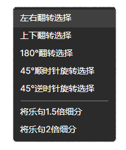

# 编辑

## 查找与替换

使用快捷键`Ctrl+F`进行查找，`Ctrl+H`进行替换。查找与替换面板与VSCode等常见文本编辑器基本相同。

## 谱面文本工具

在`右键菜单`或`编辑`菜单中，你都可以找到这些工具。

他们会对你选中的内容进行处理。

非常欢迎你提交Pull Request，为MajdataX添加更多谱面文本工具。这只是创建一个派生于IMajPlugin的类而已，非常简单（吧）。例 [MirrorPlugin.cs](https://github.com/re-poem/MajdataEdit-Neo/blob/main/Models/Plugins/MirrorPlugin.cs)